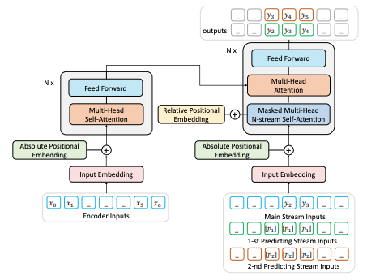
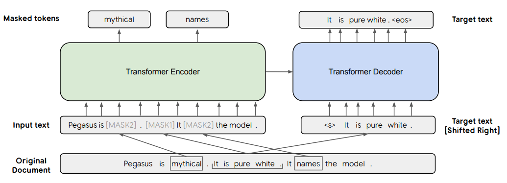
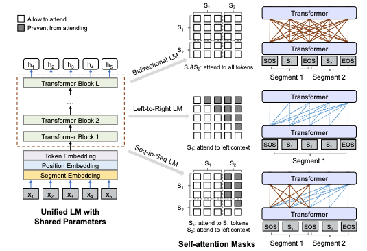
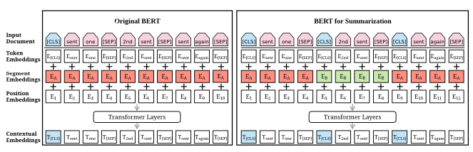
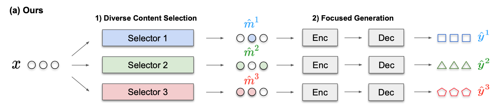
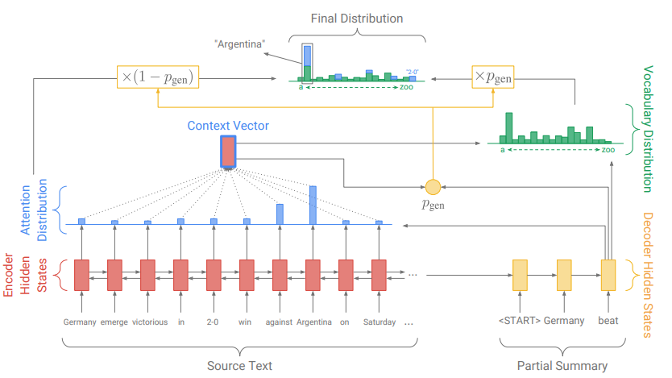

> This blog summaries the state-of-the-art (SOTA) for Abstractive Summarization based on the [leaderboard of paperswithcode.come](https://paperswithcode.com/sota/abstractive-text-summarization-on-cnn-daily).

| Rank | Method                       | Paper                                                        | Code                                            | Year |
| ---- | ---------------------------- | ------------------------------------------------------------ | ----------------------------------------------- | ---- |
| 1    | ProphetNet                   | [ProphetNet: Predicting Future N-gram for Sequence-to-Sequence Pre-training](https://arxiv.org/pdf/2001.04063v2.pdf) | https://github.com/microsoft/ProphetNet         | 2020 |
| 2    | PEGASUS                      | [PEGASUS: Pre-training with Extracted Gap-sentences for Abstractive Summarization](https://arxiv.org/pdf/1912.08777v1.pdf) | https://github.com/google-research/pegasus      | 2019 |
| 3    | UniLM                        | [Unified Language Model Pre-training for Natural Language Understanding and Generation](https://arxiv.org/pdf/1905.03197v3.pdf) | https://github.com/microsoft/unilm              | 2019 |
| 4    | BertSumExtAbs                | [Text Summarization with Pretrained Encoders](https://arxiv.org/pdf/1908.08345v2.pdf) | https://github.com/nlpyang/PreSumm              | 2019 |
| 5    | Selector & Pointer-Generator | [Mixture Content Selection for Diverse Sequence Generation](https://arxiv.org/pdf/1909.01953v1.pdf) | https://github.com/clovaai/FocusSeq2Seq         | 2019 |
| 6    | Pointer-Generator+Coverage   | [Get To The Point: Summarization with Pointer-Generator Networks](https://arxiv.org/pdf/1704.04368.pdf) | https://github.com/chz816/pointer-generator-tf1 | 2017 |

## Seq2seq

Traditional seq2seq model employs an encoder to learn the source sequence representations, and a decoder which models a conditional likelihood with the source sequence representations and the previous token as the inputs.


## ProphetNet

This paper relies on Transformer to learn **n-step** ahead prediction, which predicts the next **n** tokens simultaneously.  The benefits from this approach is:

- Encourage the model to plan for future token prediction
- Prevent overfitting on strong local correlations

Four contributions:

1. Instead of making the model to predict the next word, it modifies the architecture of Transformer to predict the future ```n-gram``` at the same time.
2. To make the prediction for the future ```n-gram```, it changes the self attention mechanism to N-stream Self Attention.
3. It modifies the positional embedding.
4. It only considers token span masking for denoising.




## PEGASUS

This paper is similar to BERT: it proposes a new self-supervised pre-training objective for abstractive summarization: Gap Sentence Generation (GSG).

The model chooses to mask the whole sentence from a document and use the rest of the documents to generate these gap-sentences. Also choosing important sentences can improve the performance of the model: use ```ROUGE1-F1``` between the sentence and the rest of the document as the proxy for importance.




## UniLM

In this paper, it pre-trains the language model using three tasks: unidirectional, bidirectional and sequence -to-sequence prediction. The model parameters are shared across the LM objectives. These parameters are learned to minimize the cross-entropy loss. The overall training objective is the sum of different types of LM objectives.




## BertSumExtAbs

This paper modifies the architecture of BERT to apply in text summarization task.




## Selector & Pointer-Generator

This paper focuses on how to generate diverse sequences. It introduces ```focus``` to sample different parts of the sentence. Each sampled ```focus``` biases the generation process leading to the diversity of the output.




## Pointer-Generator + Coverage

To overcome the limitation of the traditional seq2seq model, this paper introduces the pointer network for generating task. It keeps the model contain the ability of using the original word from the input, and the ability to generate new word.

 